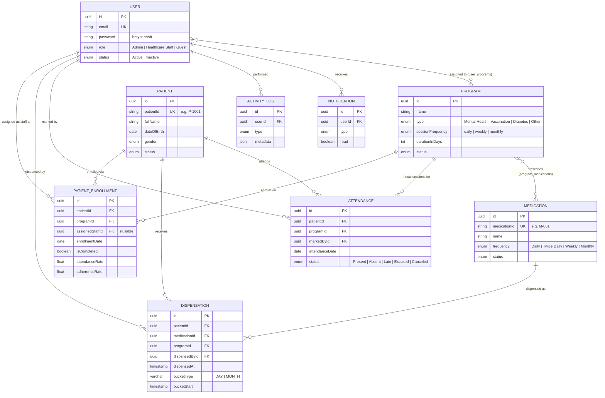

# Vitals CareOps (Health Program & Medication Tracker)

A full-stack healthcare management application for tracking patient enrollments, session attendance, and medication dispensation with comprehensive role-based access control.

## Table of Contents
- [Overview](#overview)
- [Architecture](#architecture)
- [Tech Stack](#tech-stack)
- [Setup Instructions](#setup-instructions)
- [Deployment](#deployment)
- [User Guide](#user-guide)
- [RBAC Implementation](#rbac-implementation)
- [Database Schema](#database-schema)
- [Implementation Details](#implementation-details)
- [Bonus Features](#bonus-features-implemented)
- [Challenges Faced](#challenges-faced)
- [Tradeoffs](#tradeoffs)
- [Lessons Learned](#lessons-learned)
- [Future Improvements](#future-improvements)

## Overview

This system addresses the challenge of manual tracking in healthcare settings by providing a digital platform to:
- Manage patient enrollments in health programs
- Track session attendance (one-on-one, group discussions, consultations)
- Monitor medication dispensation with duplicate prevention
- Generate progress reports and analytics
- Maintain audit trails for all activities

**Problem Solved**: Prevents missed sessions, duplicate medication dispensation, and incomplete treatment records through automated tracking and validation.

### Success Metrics

Concrete, checkable outcomes this system is designed to produce, not just formulas it can compute:

- **Zero duplicate medication dispensations under concurrent requests** — enforced by a real database unique constraint (`uq_dispensation_bucket`), not just an application-level check that a race condition could bypass. Verified directly: two simultaneous `POST /dispensations` calls for the same patient/medication/time-bucket produce exactly one success and one `400`, both against a database schema built purely from migrations (no `synchronize`).
- **100% of protected mutations attributable to a specific user** — every dispensation, attendance record, and enrollment change is written with the acting user's ID and surfaces in the activity log, so "who did this" is always answerable from the audit trail rather than reconstructed from memory.
- **Staff visibility bounded to their actual caseload** — a Healthcare Staff account querying patients, dispensations, or attendance only ever receives rows for patients enrolled in a program they're assigned to; this is enforced server-side (query-level `WHERE` filtering joined against `patient_enrollments`), not hidden client-side, so it holds even against a client that ignores it.

### Competitive Analysis

| Approach | Duplicate-dose prevention | Audit trail | Access control | Cost at this scale |
|---|---|---|---|---|
| Paper / spreadsheet tracking | None — relies entirely on staff memory and handwriting legibility | None (or manual, easily altered) | None | Free, but highest clinical-risk option |
| Generic EHR/CRM (e.g. a general-purpose clinic management SaaS) | Usually present, but as one feature among hundreds — configuration overhead and per-seat licensing cost scale with headcount | Present, but not scoped to this workflow | Present, but role model is generic (not shaped around "staff caseload") | Ongoing per-seat SaaS cost, often requiring a paid tier for RBAC/audit features |
| This system | Purpose-built database constraint, not a generic feature toggle | Purpose-built (`ActivityLog` module), scoped to this domain's actions | Purpose-built three-role model matching how this org's staff actually work (caseload-scoped) | Self-hosted; infrastructure cost only (~free tier Postgres/Render/Vercel at this scale, see [Deployment](#deployment)) |

The tradeoff: a generic EHR/CRM is faster to adopt for an org that already needs its other hundred features, and comes with vendor support. A purpose-built system like this one is a better fit when the actual requirement is narrow (program enrollment + attendance + medication dispensation for a specific health program), where a general-purpose tool's flexibility mostly shows up as unused configuration surface and unnecessary licensing cost.

## Architecture

A standalone, versioned copy of this section's diagram (kept in sync as its own diffable artifact) lives at [`docs/architecture.md`](docs/architecture.md). Architecture Decision Records for non-obvious design choices live in [`docs/adr/`](docs/adr/).

### System Overview

The frontend and backend are deployed and scaled independently (Vercel + Render), communicating exclusively over a versioned REST API secured with Bearer JWTs. The backend never trusts client-supplied identity beyond what the verified token asserts, and the database is the single source of truth — there is no shared mutable state between backend instances.

```mermaid
flowchart LR
    subgraph Client["Client"]
        Browser["Browser"]
    end

    subgraph Vercel["Vercel"]
        FE["Next.js 16 Frontend<br/>App Router, TanStack Query"]
    end

    subgraph Render["Render"]
        direction TB
        MW["Global middleware<br/>CORS &#183; Helmet-equivalent compression<br/>ValidationPipe &#183; ThrottlerGuard &#183; AllExceptionsFilter"]
        Auth["Auth Module<br/>Passport JWT/Local strategies"]
        RBAC["RolesGuard / PermissionsGuard<br/>rbac.config.ts permission matrix"]
        Modules["Feature Modules<br/>Patients &#183; Programs &#183; Medications<br/>Dispensations &#183; Attendance &#183; Reports<br/>Dashboard &#183; Notifications &#183; Activity Logs"]
        Health["/health<br/>DB connectivity check"]

        MW --> Auth --> RBAC --> Modules
        MW --> Health
    end

    DB[("PostgreSQL 16<br/>TypeORM, migrations,<br/>uq_dispensation_bucket constraint")]
    Redis[("Redis<br/>rate-limit counters<br/>(shared across instances)")]

    MW -.->|"increment/check<br/>(falls back to in-memory<br/>if REDIS_URL unset)"| Redis

    Browser -->|HTTPS| FE
    FE -->|"REST + Bearer JWT<br/>NEXT_PUBLIC_API_URL"| MW
    Modules -->|"Repository pattern<br/>@InjectRepository"| DB
    Health -->|SELECT 1| DB

    CI["GitHub Actions CI<br/>lint &#183; unit tests &#183; e2e tests &#183; build"] -.->|gates merges to main| Render
```

**Request flow (a typical protected write, e.g. recording a dispensation):**

1. Browser sends `POST /dispensations` with `Authorization: Bearer <jwt>`.
2. `ThrottlerGuard` checks the per-IP rate limit before anything else runs, backed by Redis (`RedisThrottlerStorage`) so the limit is enforced globally across every running instance, not per-instance — see [Rate Limiting](#rate-limiting).
3. `JwtAuthGuard` (Passport JWT strategy) verifies the token signature/expiry and re-checks the user is still `Active` in the database — a revoked/deactivated account is rejected even with a still-valid token.
4. `RolesGuard` and `PermissionsGuard` check the endpoint's `@Roles`/`@RequirePermissions` metadata against the authenticated user's role.
5. `ValidationPipe` (whitelist + transform) rejects any request body that doesn't match `CreateDispensationDto`.
6. `DispensationsService` runs the duplicate-prevention check, then the write — with the database's `uq_dispensation_bucket` unique constraint as the final, race-condition-proof guard.
7. Any unhandled error at any step is normalized by `AllExceptionsFilter` into a consistent `{statusCode, message, error, path, timestamp}` shape before reaching the client.

### Why this shape

- **Stateless auth (Bearer JWT, not sessions):** the backend can be scaled horizontally on Render with zero session-affinity requirements, at the cost of no built-in server-side logout (documented as a known limitation, not an oversight — see Implementation Details).
- **Guard pipeline order matters:** rate limiting runs before authentication so an unauthenticated brute-force attempt is throttled before it ever reaches password-hashing (bcrypt) work, and authorization runs after authentication so a role check never executes against an unverified identity.
- **Repository pattern via TypeORM**, not a hand-rolled data-access layer: keeps services testable (every unit test in `*.spec.ts` mocks the repository interface directly) without needing a real database, while still allowing raw `QueryBuilder` escape hatches for the aggregation-heavy dashboard/reporting queries.

## Tech Stack

**Frontend:** Next.js 16 with TypeScript, TanStack Query, Tailwind CSS, Recharts

**Backend:** NestJS with TypeORM, PostgreSQL, JWT Authentication, Swagger API Documentation

**Database:** PostgreSQL 14+

## Setup Instructions

### Prerequisites
- Node.js 18+ and npm
- PostgreSQL 14+
- Git

### Backend Setup

1. Navigate to backend directory: `cd backend`
2. Install dependencies: `npm install`
3. Create `.env` file with:
   - Database credentials (host, port, username, password, database name)
   - JWT secret and expiration
   - Application port (3001)
4. Create PostgreSQL database: `CREATE DATABASE healthtrackdb;`
5. Run migrations: `npm run migration:run`
6. Seed database (optional): `npm run seed`
7. Start server: `npm run start:dev`

Backend will run on: `http://localhost:3001`

API Documentation (Swagger): `http://localhost:3001/api`

A version-pinned, downloadable OpenAPI 3.0 spec (for generating a typed client, or diffing API changes in a PR without a running server) can be exported with `npm run openapi:export` from `backend/`, which writes `backend/openapi.json` from the same `DocumentBuilder` config the live Swagger UI uses.

### Frontend Setup

1. Navigate to frontend directory: `cd frontend`
2. Install dependencies: `npm install`
3. Create `.env.local` file (or copy from template) with: `NEXT_PUBLIC_API_URL=http://localhost:3001`
4. Start development server: `npm run dev`

Frontend will run on: `http://localhost:3000`

## Deployment

For production setup on Render (backend) and Vercel (frontend), including the CD/auto-deploy behavior, see:
- [`docs/deployment.md`](docs/deployment.md)

### Live Demo

Configured production targets (from `render.yaml` / `frontend/vercel.json`'s deployment configuration):

- **Frontend:** https://vitals-zeta.vercel.app
- **Backend API:** https://vitals-careops-api.onrender.com
- **API Docs (Swagger):** https://vitals-careops-api.onrender.com/api
- **Health check:** https://vitals-careops-api.onrender.com/health

> These are the URLs this project's infrastructure configuration is set up to deploy to. This documentation pass was done in an environment without browser or hosting access to independently click through and confirm the deployment is currently live and up to date with the latest changes in this repository — treat this as "here is where it's configured to run," not as a personally re-verified live demo link at the time of reading. Render's free tier also spins down after inactivity, so the first request after a period of no traffic may take 30-60s to respond while the instance cold-starts.

### Screenshots

Not captured in this documentation pass — the environment used to prepare this remediation had no browser/display access to run the app and take screenshots. This is flagged explicitly rather than omitted silently. To add them: run `docker compose up -d --build`, walk through Login → Dashboard → Patients → Enroll → Dispense → Reports, and drop screenshots in a `docs/screenshots/` folder referenced from this section.

### Option 1: Docker Compose (Recommended)

1. Copy environment template:
   - `cp .env.example .env`
2. Update `.env`:
   - Set a strong `JWT_SECRET`
   - Set production URLs for `FRONTEND_URL`, `CORS_ORIGIN`, and `NEXT_PUBLIC_API_URL`
3. Start the full stack:
   - `docker compose up -d --build`
4. Verify services:
   - Frontend: `http://localhost:3000`
   - Backend health: `http://localhost:3001/health`
   - Swagger (if `ENABLE_SWAGGER=true`): `http://localhost:3001/api`

### Option 2: Separate Deployments

Backend:
1. Copy env template: `cp backend/.env.example backend/.env`
2. Set production values in `backend/.env`
3. Install/build:
   - `cd backend`
   - `npm ci`
   - `npm run build`
4. Run migrations and start:
   - `npm run start:prod:migrate`

Frontend:
1. Copy env template: `cp frontend/.env.example frontend/.env.local`
2. Set API URL in `frontend/.env.local`
3. Install/build/start:
   - `cd frontend`
   - `npm ci`
   - `npm run build`
   - `npm run start`

### Default Login Credentials

After running seed (`npm run seed`):
- **Admin**: `admin1@healthtrack.app` / `password123`
- **Healthcare Staff**: `staff1@healthtrack.app` / `password123`
- **Guest**: `guest1@healthtrack.app` / `password123`

**Seed Data Created:**
- 5 Admin users
- 20 Healthcare Staff
- 3 Guest users
- 120 Patients with various statuses
- 14 Health Programs
- 20 Medications with different frequencies
- Patient enrollments, attendance records, and dispensations spanning 6 months

## User Guide

### For Admin Users

**Dashboard**: View system-wide metrics, charts, and recent activities

**Programs Management**: Create and manage health programs, assign medications, set session frequencies, assign healthcare staff

**Patient Management**: Register patients, enroll in programs, assign to healthcare staff, view progress

**Medications**: Create medications, set dosages and frequencies (Daily, Twice Daily, Weekly, Monthly)

**Users**: Manage user accounts, assign roles, assign staff to programs

**Reports**: Generate and export reports for patients, programs, medications, and attendance

**Activity Logs**: View complete audit trail of all system activities

### For Healthcare Staff

**Dashboard**: View metrics for assigned patients and programs

**My Patients**: View and manage only assigned patients

**Attendance**: Record session attendance (Present, Absent, Late, Excused, Canceled)

**Dispensations**: Dispense medications to assigned patients (with duplicate prevention)

**Reports**: Generate reports for assigned patients

**Notifications**: Receive alerts for overdue medications and missed sessions

### For Guest Users

**Programs**: View public program information only

**Read-Only Access**: Cannot access patient data, attendance, or dispensations

## RBAC Implementation

### Role-Based Access Control (RBAC)

The system implements a comprehensive role-based access control system with three roles:

#### 1. Admin Role
**Full System Access**
- ✅ Manage users (create, update, delete)
- ✅ Manage programs (full CRUD)
- ✅ Manage patients (full CRUD)
- ✅ Manage medications (full CRUD)
- ✅ Assign staff to programs
- ✅ View all data across the system
- ✅ Generate system-wide reports
- ✅ Access activity logs
- ✅ Access dashboard with all metrics

#### 2. Healthcare Staff Role
**Program & Patient Management**
- ✅ View assigned programs only
- ✅ Manage assigned patients
- ✅ Record session attendance
- ✅ Dispense medications to assigned patients
- ✅ View assigned patient data
- ✅ View medications for assigned programs
- ✅ Generate reports for assigned patients
- ❌ Cannot manage users
- ❌ Cannot create programs
- ❌ Cannot access unassigned patient data

#### 3. Guest Role
**Read-Only Public Access**
- ✅ View public program information
- ✅ View program types and schedules
- ❌ Cannot access patient data
- ❌ Cannot record attendance
- ❌ Cannot dispense medications
- ❌ Cannot manage any entities

### How RBAC Works

**Authentication Layer:**
- JWT tokens protect all routes
- Users must be authenticated to access the system
- Tokens expire after 24 hours for security

**Authorization Layer:**
- Role guards check user permissions before allowing access
- Data is filtered automatically based on user role
- Healthcare Staff see only their assigned patients and programs
- Frontend routes are protected based on user role

**Data Filtering:**
- Admin: Full access to all system data
- Healthcare Staff: Only assigned patients, programs, and related data
- Guest: Public program information only

**Audit Trail:**
- All actions are logged with user attribution
- Dispensations track which staff member performed the action
- Activity logs maintain complete history

### Security Features

**Password Security:** Bcrypt hashing, minimum password requirements

**Token Management:** JWT with expiration, automatic logout, token refresh

**Input Validation:** All inputs validated, TypeScript type checking, SQL injection prevention

**Authorization:** Role validation on every request, resource ownership verification

### Rate Limiting

Global rate limiting via `@nestjs/throttler` (30 req/s default bucket, 5 req/min on `/auth/login`), backed by a custom `RedisThrottlerStorage` (`backend/src/common/throttler/redis-throttler-storage.service.ts`) when `REDIS_URL` is configured. This matters because the naive in-memory storage `@nestjs/throttler` ships with keeps counters in a per-process `Map` — invisible the moment more than one instance of the API is running, since each instance would enforce its own independent limit (N instances silently multiply the real ceiling by N). With Redis, the limit is enforced atomically (a single Lua script per check) across every instance sharing that Redis. If `REDIS_URL` is unset — local development, CI, or a deliberate single-instance deployment — it falls back to the in-memory implementation rather than failing to boot.

### Password Storage

The `password` column on `User` is declared `select: false` at the entity level, so it is excluded from every query by default — including relations (a `Dispensation.dispensedBy`, `Attendance.markedBy`, or `Program.assignedStaff` User). This was added after directly verifying (not just code-reading) that `GET /dispensations` and `GET /users` responses embedded the full `dispensedBy`/user object with the bcrypt hash included, because those endpoints load `User` transitively through a relation rather than as the primary queried entity — a class of leak that per-service `const { password, ...rest } = user` destructuring does not protect against. Only `AuthService.validateUser` and `AuthService.updateProfile` explicitly opt back into selecting it, since they need the real hash to call `bcrypt.compare`.

### Database TLS

`DB_SSL_REJECT_UNAUTHORIZED` defaults to `true` (verify the database server's certificate) in any non-development environment, and logs a startup warning if explicitly disabled. See `backend/src/config/database.config.ts`.

## Database Schema

### Entity-Relationship Diagram

Reflects the schema as actually declared in `backend/src/entities/*.entity.ts` and enforced by the migrations in `backend/src/migrations/` — every relationship and constraint below is backed by a real TypeORM decorator or SQL constraint, not aspirational documentation.

**`DISPENSATION` carries a composite unique constraint** — `uq_dispensation_bucket` on `(patientId, medicationId, bucketType, bucketStart)` — enforced at the database layer, not just in application code. This is what actually prevents a duplicate medication collection under concurrent requests: two simultaneous `POST /dispensations` calls for the same patient/medication/time-bucket will have one succeed and one fail with a Postgres `23505` unique-violation, which `DispensationsService.create()` catches and translates into a `400 Bad Request` with a human-readable message (see `backend/src/modules/dispensations/dispensations.service.ts`). This constraint, and the `bucketType`/`bucketStart` columns it covers, are created by `backend/src/migrations/1700000000000_initial_schema.ts` and corrected for pre-existing databases by `1740000000000_fix_dispensation_bucket_schema.ts` — verified by running `migration:run` against a genuinely empty database and confirming both the columns and the constraint exist afterward (not just assumed from the entity decorator).

**RBAC is enum-based only.** An earlier revision of this schema also carried relational `Role`/`Permission` tables (a `user_roles` many-to-many join, intended for future runtime-configurable roles) alongside the enum-based model actually enforced by `RolesGuard`/`PermissionsGuard`. That relational schema was never wired into any guard and has been removed — see [`docs/adr/0001-rbac-model.md`](docs/adr/0001-rbac-model.md) for the decision record. Every role/permission check in this application goes through the `ROLE_PERMISSIONS` map in `backend/src/common/rbac/rbac.config.ts`.

### Core Entities

**User**: Stores user accounts with UUID, name, unique email, hashed password, role (Admin/Healthcare Staff/Guest), status, assigned programs, and timestamps.

**Program**: Health programs with auto-generated ID (PROG-001), name, type (Mental Health, Vaccination, Diabetes, etc.), session frequency (Daily/Weekly/Monthly), status, assigned medications and staff.

**Patient**: Patient records with auto-generated ID (P-1001), full name, date of birth, gender, contact information, address, status, and enrollment history.

**PatientEnrollment**: Links patients to programs with enrollment date, assigned healthcare staff, completion status, and end date.

**Medication**: Medications with auto-generated ID (M-001), name, dosage, frequency (Daily/Twice Daily/Weekly/Monthly), program type, status, and assigned programs.

**Dispensation**: Tracks medication dispensation with patient, medication, program, dispensed-by user, timestamp, quantity, notes, and duplicate prevention fields (bucketType, bucketStart). **UNIQUE constraint prevents duplicate collections.**

**Attendance**: Records session attendance with patient, program, date, status (Present/Absent/Late/Excused/Canceled), check-in time, and notes.

**Notification**: User notifications with type (Medication/Session/Alert/Info), title, message, read status, and optional link.

**ActivityLog**: Audit trail with user, activity type (Patient/Program/Medication/Attendance/User), description, metadata JSON, and timestamp.

### Entity Relationships

- Users have many activity logs, notifications, and dispensations
- Users and Programs have many-to-many relationship (staff assignments)
- Programs have many medications (many-to-many), enrollments, and attendance records
- Patients have many enrollments, dispensations, and attendance records
- Medications have many dispensations
- Enrollments link patients to programs with assigned staff

### Key Constraints & Indexes

**Unique Constraints:** User email, Dispensation (patientId + medicationId + bucketType + bucketStart)

**Indexes:** Created on frequently queried fields (email, role, patientId, programId, status, dates)

**Data Integrity:** Entities use soft delete to prevent accidental data loss

## Implementation Details

### Duplicate Prevention Logic

**Challenge:** Prevent duplicate medication collection based on frequency (daily, weekly, monthly).

**Solution:** Bucket-based duplicate prevention system:
- Each dispensation is assigned to a time bucket (DAY or MONTH)
- Bucket start time calculated based on medication frequency
- Database UNIQUE constraint on (patientId + medicationId + bucketType + bucketStart)
- Daily medications: Can only be collected once per day
- Weekly medications: Can only be collected once per week
- Monthly medications: Can only be collected once per month
- Twice-daily medications: Maximum 2 collections per day with additional validation

### Progress Tracking & Adherence Calculations

**Attendance Rate:** Calculated as (completed sessions / expected sessions) × 100, where expected sessions are based on program frequency and enrollment period.

**Medication Adherence Rate:** Calculated as (dispensed medications / expected medications) × 100, where expected medications are based on each medication's frequency and enrollment period.

### Assumptions & Design Decisions

**Program Enrollment:** Patients can be enrolled in multiple programs simultaneously. Enrollment requires healthcare staff assignment. Dates can be backdated for historical tracking.

**Medication Dispensation:** Medications are program-specific. Each dispensation records who dispensed it (accountability). Quantity tracked as string to support various units (tablets, ml, doses). Historical dispensations preserved for audit trail.

**Attendance Tracking:** Recorded per program session with multiple statuses (Present, Absent, Late, Excused, Canceled). Check-in time optional. Past attendance can be updated.

**User Management:** Admin accounts cannot self-register (security). Healthcare staff assigned to programs, patient access derived from program assignments. 

## Bonus Features Implemented

✅ **Status Badges**: Color-coded indicators for programs (Active/Inactive/Completed), patients, medications, and attendance statuses throughout the UI.

✅ **Alerts & Notifications**: Real-time notification system with medication due alerts, missed session notifications, notification bell with unread count, and mark as read/unread functionality.

✅ **Export Reports (CSV)**: Generate and download patient progress, program enrollment, medication dispensation, and attendance reports as CSV files with customizable date ranges.

✅ **Activity Logs / Audit Trail**: Complete searchable audit trail tracking all user actions (Patient, Program, Medication, Attendance, User operations) with timestamps, user attribution, and metadata..

✅ **Progress Tracking Charts**: Interactive data visualizations including Program Distribution (Pie Chart), Attendance Trends (Line Chart), and real-time dashboard metrics.

## Challenges Faced

**Schema drift between `synchronize` and migrations.** The `Dispensation` entity and service code used `bucketType`/`bucketStart` columns and relied on a `uq_dispensation_bucket` constraint, but no migration had ever created them — only a prior migration's *different*, unrelated `frequency`/`bucketStartAt` columns existed. This was invisible in local development and CI because both run with `NODE_ENV=development`, where TypeORM's `synchronize` silently creates the correct schema from entities directly, bypassing migrations entirely. It was only caught by deliberately running `migration:run` against a genuinely empty database with `synchronize` disabled — the same code path a real production deploy uses. Worse, that same clean-database test revealed the migrations couldn't run *at all* from scratch: there was no baseline "create everything" migration, meaning the two existing incremental migrations had only ever been applied against a database whose base schema was created some other way (almost certainly `synchronize`, at some point, outside the migration history). Fixing this required generating a proper initial-schema migration and making every migration idempotent (guarded with `IF NOT EXISTS` / `DO $$ ... $$` existence checks) so it's safe to run against both a fresh database and one that already has some of this schema from an earlier, non-migration-based bootstrap.

**A password hash leaking through relations, not the primary entity.** Every service that directly returned a `User` already stripped the password field (`const { password, ...rest } = user`). But `User` also gets loaded *transitively* — a `Dispensation.dispensedBy`, an `Attendance.markedBy`, a `Program.assignedStaff` — and those relation loads serialized straight into JSON responses with the bcrypt hash included, because the stripping pattern only covers the one call site a developer remembers to add it to. This wasn't caught by reading the code; it was caught by actually calling the API and looking at the raw response bodies. The fix (`select: false` on the entity column) is a single change that closes the class of bug everywhere at once, rather than one more place to remember to destructure.

**Reconciling pagination fixes without breaking the frontend.** Adding real page-based pagination to `GET /dispensations` looked like an unambiguous improvement (the endpoint had no limit at all), but the frontend calls it from three different places with different expectations — one scoped to a single patient's full history, one that fetches everything and filters client-side by medication, and one genuine paginated table view of a *different* endpoint. Changing the response envelope would have silently broken two of the three (one by crashing, one by silently showing zero results via a defensive `Array.isArray` check). The actual fix was a defensive cap on the existing bare-array response rather than a shape change — a smaller, less impressive-looking fix, but the one that doesn't regress working functionality it wasn't safe to coordinate a frontend change for in the same pass.

## Tradeoffs

- **PostgreSQL over a NoSQL store.** This domain is inherently relational (patients ↔ enrollments ↔ programs ↔ dispensations, with real foreign-key integrity and a duplicate-prevention constraint that depends on relational uniqueness guarantees). A document store would have made the one invariant that matters most in a healthcare context — "don't double-dispense a medication" — much harder to enforce atomically at the data layer.
- **Redis-backed rate limiting is optional infrastructure, not a hard dependency.** `RedisThrottlerStorage` falls back to per-instance in-memory limiting when `REDIS_URL` is unset, rather than failing to boot. This keeps local development and CI simple (no Redis service required) at the cost of the rate limit being genuinely global only when Redis is actually provisioned — an explicit, documented tradeoff rather than a silent gap.
- **Enum-based RBAC over a database-driven permission model.** See [ADR-0001](docs/adr/0001-rbac-model.md) for the full reasoning — the short version is that a static, code-defined permission map is the right amount of flexibility for a 3-role application that doesn't need non-developers configuring roles at runtime, even though it means a new role requires a code change and redeploy.
- **No server-side token revocation (stateless JWT only).** A leaked access token remains valid until its natural expiry. This trades off real-time revocation for horizontal scalability with zero session-affinity/shared-state requirements. See [Future Improvements](#future-improvements) for the concrete upgrade path (short-lived access + refresh-token rotation).
- **Dispensation list endpoints return a bare array with a defensive cap, not full pagination**, specifically to avoid an uncoordinated breaking change across three frontend call sites with different consumption assumptions (see Challenges above). This is intentionally the less "complete" of two possible fixes, chosen because it doesn't risk silently regressing working functionality.

## Lessons Learned

- **"CI is green" and "the feature works in production" are different claims**, and the gap between them is exactly where the schema-drift and dead-migration bugs above were hiding. Both dev and CI ran with `synchronize: true`-equivalent behavior; the only way to find the production-path bug was to deliberately simulate production (clean database, `synchronize: false`, migrations only, compiled `dist/` output) rather than trust that a green CI run implied a working deploy.
- **A missing `tsconfig.build.json` is a silent, severe bug in a NestJS project**, not a cosmetic one. Without it, `nest build` compiled test files alongside source, which shifted TypeScript's inferred root directory and nested the output under `dist/src/` instead of `dist/`, meaning `node dist/main` — what both `npm run start:prod` and Render's configured start command actually run — would have failed outright. This is the kind of bug that's invisible in every dev workflow (`start:dev` never touches `dist/`) and only surfaces at the worst possible time: a production deploy.
- **Grep for a pattern before assuming a fix generalizes.** The instinct after finding one `select: false`-shaped bug (password leaking via relations) or one pagination-shaped gap was to apply the same fix everywhere uniformly. In both cases, checking every actual call site first (three different frontend consumers of one endpoint; two legitimate places that need the real password hash) prevented shipping a "consistent" fix that would have broken something a blanket approach would have missed.

## Future Improvements

- Real token revocation: short-lived access tokens + refresh-token rotation stored server-side (Redis or a `refresh_tokens` table), with an actual `POST /auth/logout` that revokes the refresh token — see the "no server-side logout" tradeoff above.
- Redis-backed caching for the `dashboard`/`reports` aggregate endpoints, with invalidation on the writes that affect them, paired with the already-installed `@nestjs/schedule` for a nightly recompute of `PatientsService.recomputeProgress()`.
- OpenTelemetry tracing and a real error-tracking integration (Sentry) on both frontend and backend — today, a silent failure in production has no alerting path beyond the `/health` endpoint.
- A genuine staging environment tier, distinct from dev/production, for validating schema migrations and infrastructure changes (like this remediation's migration fixes) against production-like data volume before they reach production.
- API versioning and a published, hosted OpenAPI spec (the Swagger UI is real and live at `/api`, but there's no version-pinned, downloadable spec file for consumers who want to generate a typed client).
- Browser-level E2E coverage (Playwright) for the login → enroll → dispense → report flow, complementing the existing API-level e2e suite.
- A genuine domain layer independent of NestJS/TypeORM, so invariants like the dispensation-bucket uniqueness rule are expressed and tested once rather than split across an entity decorator, a service-level pre-check, and a migration.

## Author

**Odile Duhirimana**
- GitHub: [@OdileDuhirimana](https://github.com/OdileDuhirimana)
- Email: odileduhirimana@gmail.com

---

**Submission Date**: November 3, 2025  
**Assessment**: Full-Stack Internship - Health Program & Medication Tracker
