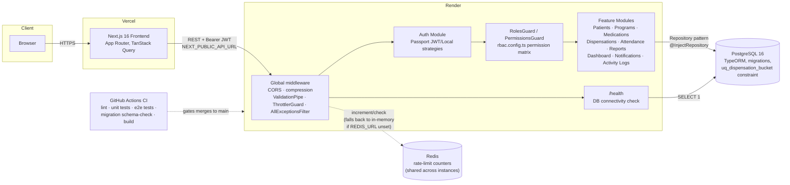

# Architecture

Standalone, versioned copy of the system diagram in the [README](../README.md#architecture) — kept here as its own artifact so architectural changes are visible as a diff on this file specifically, independent of README prose edits.

**Verification note:** this diagram is checked against the actual current state of the code and infrastructure config (`backend/src/entities/*.entity.ts`, `backend/src/migrations/`, `backend/src/app.module.ts`, `render.yaml`, `frontend/vercel.json`) as of the same pass that fixed the schema-drift bug described in the README's "Challenges Faced" section — a prior revision of this diagram claimed a database constraint that did not actually exist in any migration. That specific discrepancy is what the "verified" claim below is based on: the constraint now genuinely exists (confirmed by running `migration:run` against an empty database), not just declared in code.

## System Diagram

## Component responsibilities

| Component | Responsibility | Key file(s) |
|---|---|---|
| Frontend (Vercel) | Renders UI, holds no business logic beyond client-side form validation/UX; every write is re-validated server-side | `frontend/src/app/`, `frontend/src/services/api-client.ts` |
| `AllExceptionsFilter` | Normalizes every error (validation, ORM, unexpected) into one consistent JSON shape, never leaks driver internals | `backend/src/common/filters/all-exceptions.filter.ts` |
| `ThrottlerGuard` + `RedisThrottlerStorage` | Rate limiting, enforced globally across instances when Redis is configured | `backend/src/common/throttler/redis-throttler-storage.service.ts` |
| `JwtAuthGuard` / `JwtStrategy` | Verifies token signature/expiry, re-checks the user is still `Active` in the DB on every request | `backend/src/modules/auth/` |
| `RolesGuard` / `PermissionsGuard` | Enum-based RBAC enforcement — see [ADR-0001](adr/0001-rbac-model.md) for why this is the only RBAC model | `backend/src/common/guards/`, `backend/src/common/rbac/` |
| Feature modules | Controller → Service → Repository per domain area; service-level ownership checks beyond simple role gates (e.g. staff-to-patient assignment) | `backend/src/modules/*` |
| PostgreSQL | Single source of truth; the `uq_dispensation_bucket` constraint is the actual, database-enforced defense against concurrent duplicate dispensation | `backend/src/entities/`, `backend/src/migrations/` |
| Redis (optional) | Cross-instance rate-limit state; absence degrades to per-instance in-memory limiting rather than failing | `docker-compose.yml`, `render.yaml` |
| GitHub Actions CI | Lint, unit tests, e2e tests against real Postgres, a migration-schema check against a clean database, frontend lint/test/build, backend build | `.github/workflows/ci.yml` |

## Known architectural debt

Documented rather than hidden — see the README's Tradeoffs/Future Improvements sections and the individual ADRs in `docs/adr/` for the reasoning behind each:

- No dependency-inversion boundary between services and TypeORM (concrete repository injection, not a ports-and-adapters interface) — acceptable for this application's size; would matter more with multiple persistence backends or heavier unit-test isolation needs.
- No domain layer independent of NestJS/TypeORM — business rules (e.g. dispensation-bucket uniqueness) are expressed in the entity decorator, a service-level pre-check, and a migration, rather than once in a framework-independent model.
- Notification/activity-log side effects use a repeated "best-effort, swallow the error" `try/catch` pattern in several services rather than a shared utility or domain-event mechanism — functionally correct (a notification failure shouldn't fail the primary operation) but duplicated.
